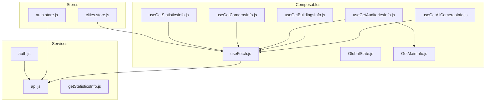

# Тестирование проекта

## Подход к тестированию

В проекте используются **unit-тесты** на базе Vitest. Тестируются модули бизнес-логики:

- **Services** — HTTP-запросы, API, чистые функции
- **Stores** — состояние Pinia, геттеры и экшены
- **Composables** — переиспользуемая логика (хуки Vue)

Внешние зависимости (fetch, localStorage, Quasar Notify/Loading, API-модули) **мокируются** через `vi.mock()` и `vi.fn()`.

## Команды запуска

```bash
# Запуск тестов в watch-режиме
yarn test
# или
npm run test

# Однократный прогон
yarn test:run
# или
npm run test:run
```

## Структура тестов

| Файл теста                                     | Модуль                  | Что тестируется                                                                                      | Зачем                                                            |
| ---------------------------------------------- | ----------------------- | ---------------------------------------------------------------------------------------------------- | ---------------------------------------------------------------- |
| `src/services/api.spec.js`                     | api.js                  | clearAuthState, getResponse (успех/ошибка), postResponseWithoutAuth, deleteResponse                  | Проверка базовых HTTP-методов, обработки ошибок и auth-состояния |
| `src/services/auth.spec.js`                    | auth.js                 | checkUser (успех и ошибка)                                                                           | Проверка проверки пользователя и обработки сбоев                 |
| `src/services/getStatisticsInfo.spec.js`       | getStatisticsInfo.js    | getReportTypes, getStatisticsTypes                                                                   | Чистые функции — конфигурация типов отчётов и статистики         |
| `src/stores/cities.store.spec.js`              | cities.store.js         | findCityById, getSlugByCityId, fetchCities (успех/ошибка/идемпотентность), refetchCities             | Геттеры и загрузка городов                                       |
| `src/stores/auth.store.spec.js`                | auth.store.js           | isAuthenticated, login, logout                                                                       | Аутентификация и выход                                           |
| `src/composables/GetMainInfo.spec.js`          | GetMainInfo.js          | getRoomTypesInfo, getLocalizedTypeLabel                                                              | Типы помещений и локализация                                     |
| `src/composables/GlobalState.spec.js`          | GlobalState.js          | useGlobalState, getTheme, setTheme, getLastBuildingId, setLastBuildingId, clearLastBuildingId        | Глобальное состояние и предпочтения                              |
| `src/composables/useFetch.spec.js`             | useFetch.js             | loadFromUrl, useFetchList, useFetchListOnMounted                                                     | Загрузка данных по URL и реактивные списки                       |
| `src/composables/useGetStatisticsInfo.spec.js` | useGetStatisticsInfo.js | useStatisticsByDay (URL, загрузка, маппинг)                                                          | Статистика по дням и форматам                                    |
| `src/composables/useGetAuditoriesInfo.spec.js` | useGetAuditoriesInfo.js | useCreateAuditory, useUpdateAuditory, useDeleteAuditory, useCreateCity, useUpdateCity, useDeleteCity | CRUD для аудиторий и городов                                     |
| `src/composables/useGetBuildingsInfo.spec.js`  | useGetBuildingsInfo.js  | useCreateBuilding, useUpdateBuilding, useDeleteBuilding, getBuildingAuditories                       | CRUD для зданий                                                  |
| `src/composables/useGetCamerasInfo.spec.js`    | useGetCamerasInfo.js    | useCreateCamera, useUpdateCamera, useDeleteCamera                                                    | CRUD для камер                                                   |

## Диаграмма зависимостей и покрытия



Все модули на диаграмме покрыты тестами, кроме useGetAllCamerasInfo (тонкая обёртка над useFetch).

## Краткая статистика

- **Всего тестов:** 64
- **Файлов с тестами:** 12
- **Модулей без явных тестов:** useGetCamerasInfo, useGetAllCamerasInfo (обёртки над useFetch, покрываются косвенно)
